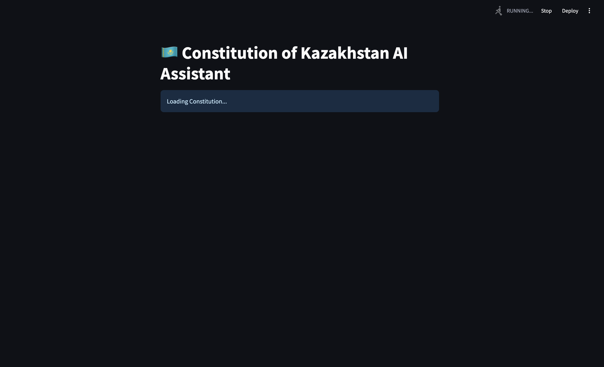
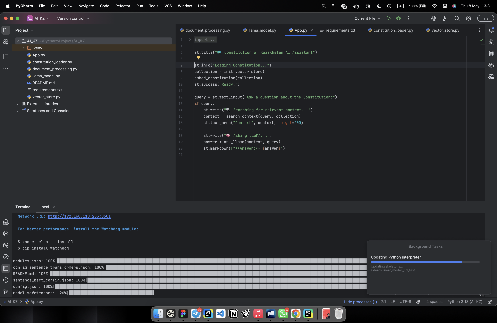
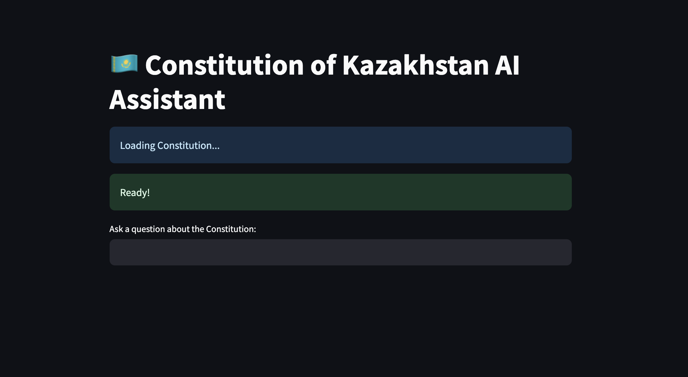
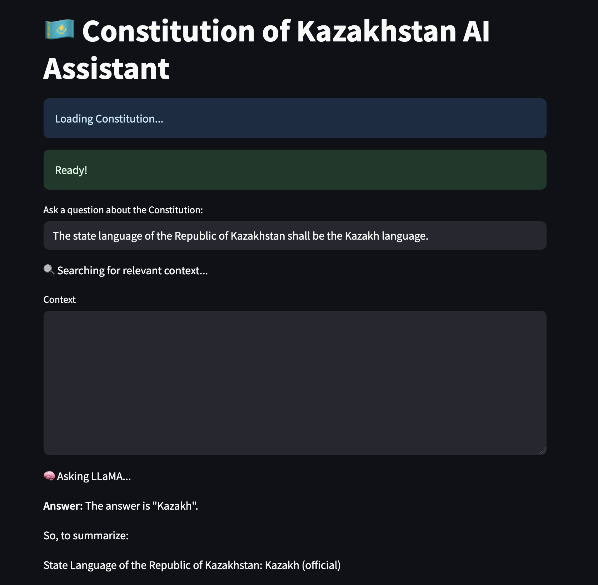

# 🇰🇿 AI Assistant – Constitution of the Republic of Kazakhstan

This is a **local AI Assistant** that answers any question related to the **Constitution of the Republic of Kazakhstan**, using a locally hosted **LLaMA model via Ollama**, with support for **semantic search** via **ChromaDB** and **Streamlit UI**.

> All answers are based strictly on the official English version of the Constitution from [akorda.kz](https://www.akorda.kz/en/constitution-of-the-republic-of-kazakhstan-50912).

---

## 🚀 Usage

### 📦 1. Install Dependencies

```bash
pip install -r requirements.txt

ollama pull llama3

streamlit run app.py


``` Examples

✅ Example 1

Question:

    What is the highest legal force in the Republic of Kazakhstan?

Answer:

    The Constitution has the highest legal force in the Republic of Kazakhstan. Laws and other legal acts must not contradict the Constitution.

✅ Example 2

Question:

    Can the President dissolve the Parliament?

Answer:

    Yes, under specific constitutional conditions, the President of the Republic of Kazakhstan has the right to dissolve the Parliament.

✅ Example 3

Question:

    What rights do citizens have in regard to religion?

Answer:

    Citizens have the right to freedom of conscience. Everyone has the right to independently determine their attitude toward religion, to profess any religion or none at all, and to participate in religious services.


## img





